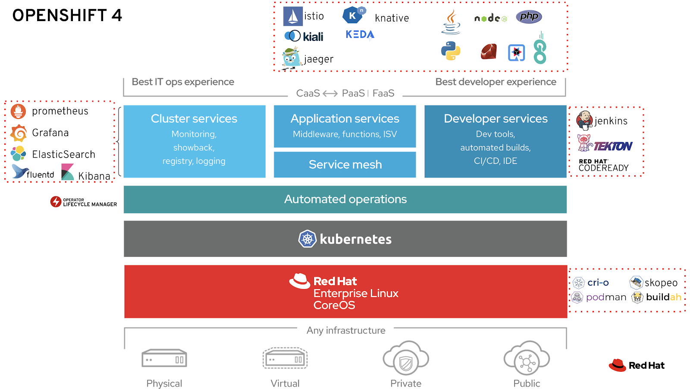
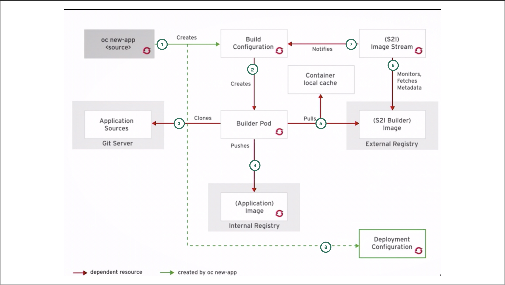
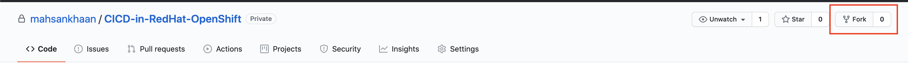
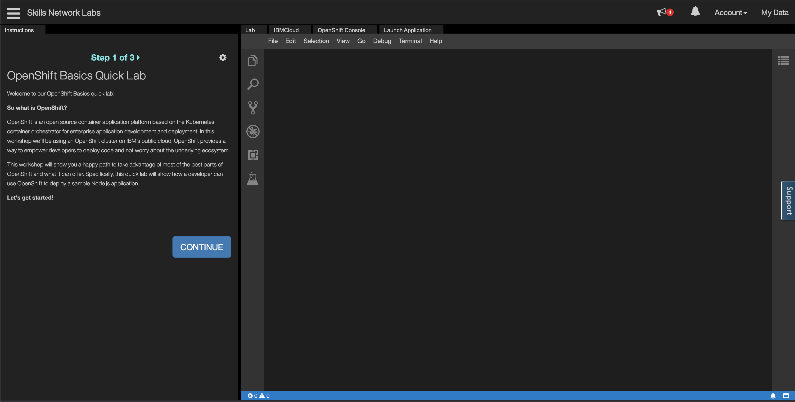
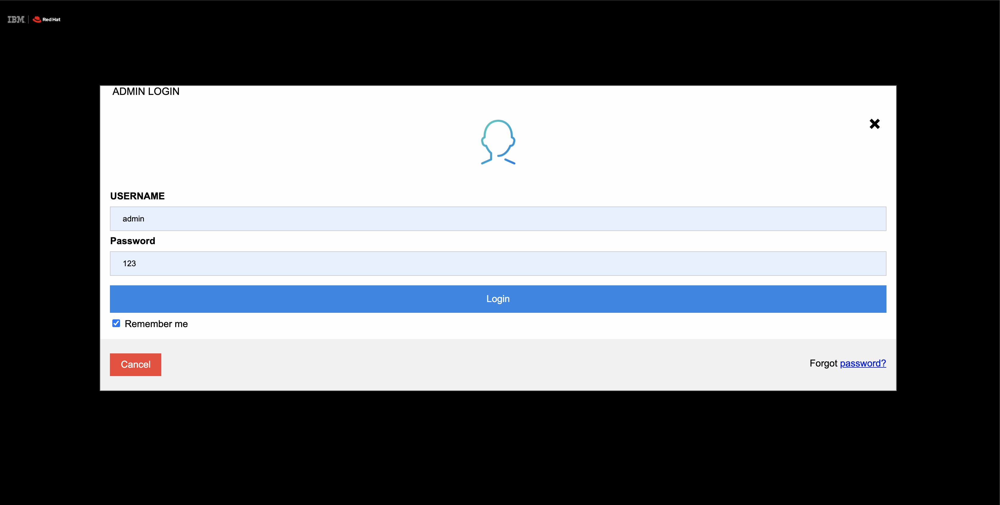

__Continuous Integration & Delivery in RedHat OpenShift__

Red Hat® OpenShift® is an enterprise-ready Kubernetes container platform with full-stack automated operations to manage hybrid cloud and multicloud deployments. Red Hat OpenShift is optimized to improve developer productivity and promote innovation

CI/CD is one of the popular use-cases for OpenShift Container Platform. OpenShift scales the pipeline execution through on-demand provisioning in containers. OpenShift provides an end-to-end solution for building complete deployment pipelines and removes the wait time for running builds in large projects

## Steps
1. [Important Terminologies](#step-1-important-terminologies)
1. [Understand CICD Workflow in RedHat OpenShift](#step-2-understand-CICD-workflow-in-redhat-openshift)
1. [Fork the GitHub repository](#step-3-fork-the-github-repository)
1. [Get RedHat OpenShift CodeLab](#step-4-Get-RedHat-OpenShift-CodeLab)
1. [Deploy an application using S2I Method](#step-5-deploy-an-application-using-S2I-Method)
1. [Update some code to check continuous Integration and Delivery](#step-6-Update-some-code-to-check-continuous-Integration-and-delivery)

### Step 1. Important Terminologies

__Source-to-Image:__ Developers do not need to be experts in Dockerfiles or either operating system commands. S2I is responsible to create resources for developers, we only need to pass our central repository URL.   

__Build Config:__ The build config is responsible to fetch the code from central repo and build an image in OpenShift and push them in the internal Docker registry.

__Deploy Config__: Once the image is successfully built then deploy config is responsible for deploying the application in pods into OpenShift.

### Step 2. Understand CICD Workflow in RedHat OpenShift

1. First, when we pass __oc new-app__ it will create a __Build Configuration__.
1. It will create a __Builder pod__ that clones the application from the central repo.
1. Once the source code successfully cloned it will create an __image__ 
1.  __Builder pod__ pushes the image to the external and internal registry.
1. Check if the image is created from the available images in OpenShift or need to create a fresh image layer.
1. __S2I image stream__ will check if there are any changes in the image.
1. The change will be notified to __Build Config__
1. Once the complete process of Build is done then comes the responsibility of __Deployment Configuration__ to create the pods in OpenShift depending on the image specifications.

### Step 3. Fork the GitHub repository
1. Open this [repo](https://github.com/mahsankhaan/CICD-in-RedHat-OpenShift)
1. And then click on __Fork__ on the top right.

__NOTE__ : This is a important step because in lab you will provide your fork repo or else change in the code will not trigger.

### Step 4. Get RedHat OpenShift CodeLab 
1. Get a free lab from [here](https://developer.ibm.com/tutorials/openshift-basics-workshop-labs/)
1. Click on __Access the OpenShift Lab__ and you will be redirected to the lab page (wait it will take somme time to provision the lab resources)
1. Once it is done you can see the below page.

### Step 4. Get RedHat OpenShift CodeLab 
1. Get a free lab from [here](https://developer.ibm.com/tutorials/openshift-basics-workshop-labs/)
1. Click on __Access the OpenShift Lab__ and you will be redirected to the lab page (wait it will take some time to provision the lab resources)
1. Once it is done you can see the below page.

### Step 5. Deploy an application using S2I Method
1. Click on __Terminal__ on top. 
1. Run command `oc status` to check cluster is provisioned successfully, the current project as __sn-labs-mahsankhan__ .(in your case it will be different) 
1. Run command `oc new-app --name=bankapplication https://github.com/mahsankhaan/CICD-in-RedHat-OpenShift.git` to deploy the application (Please note GitHub URL will be your fork URL done in [Step 3](#step-3-fork-the-github-repository))
1. Build will start and you can see the logs by `oc logs -f bc/bankapplication` 
1. Run command `oc get pods -w` and can verify build and deploy stages are successfully complete and one pod is running __bankapplication-1-n6ddx__ (in your case it will be different) 
1. Pass command `oc expose svc/bankapplication` to expose the application to the world.
1. Now get the route of the application `oc get routes`. Open the host (bankapplication-sn-labs-mahsankhan.labs-user-sandbox-...) in the browser and check bank application is up and running.

### Step 6. Update some code to check continuous Integration and Delivery

1. Open the [repo](https://github.com/mahsankhaan/CICD-in-RedHat-OpenShift.git) (in your case kindly open your __Fork__ repo) this is important because you can't make a change in this repo directly.
1. Open Folder __views__ -> __admin_login.ejs__  (Open File at line 141 make it __WELCOME ADMIN LOGIN__), Click commit changes.
1. Now again open the terminal and pass command `oc start-build bankapplication` now complete workflow will take place as discussed in [Step 2](#step-2-understand-CICD-workflow-in-redhat-openshift) .
1. Again run the command `oc get pods` and now can check a new __build-2__ is running. A newly updated pod would be created __bankapplication-2-vb8rg__ and the previous one would be deleted.
1. Open the same URL again and can verify the update.

